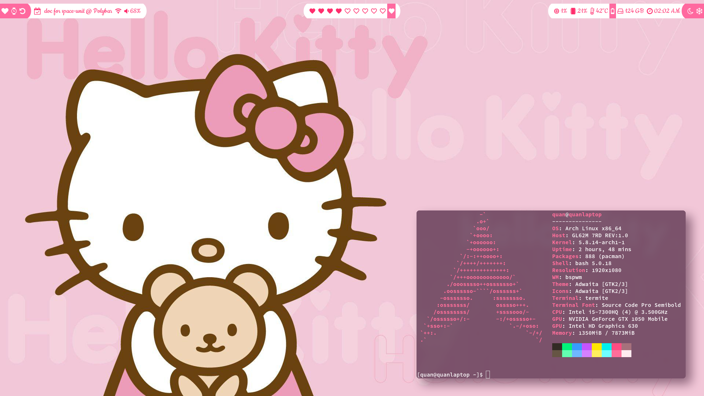

# hello-kitty
A cute theme for Arch Linux

## Dependencies
This theme is created in a system with these packages installed:
* Window manager: bspwm-rounded-corners
* Terminal: termite
* Compositor: picom
* Keyboard shortcuts: sxhkd
* App launcher: dmenu
* Audio: alsa
* Status bar: [my fork of polybar](https://github.com/DRKblade/polybar)
* Task list: task (taskwarrior)

## Installation guide
Here are the resource files and the directories to put them
* fonts/            -> ~/.local/share/fonts/
* polybar           -> ~/.config/polybar/
* others/bspwmrc    -> ~/.config/bspwm/bspwmrc
* others/dmenu.sh   -> ~/.config/dmenu.sh
* others/picom.conf -> ~/.config/picom.conf
* others/sxhkdrc    -> ~/.config/sxhkd/sxhkdrc
* others/termite    -> ~/.config/termite/config
* background.png    -> set as desktop background

## Instruction on custom scripts
### Timer
The timer script module is displayed as the watch icon on the left of polybar. I used it as a pomodoro timer.
* Left click to add 5 minutes
* Right click to subtract 5 minutes
* When the timer runs out, a ping sound will be played every second. Right click the timer to stop this.

### Task view
The task view script module is to the right of the timer module, next to the reload icon. It will display tasks from taskwarrior.
* Left click will move to the next task
* Right click will mark the current task as done
